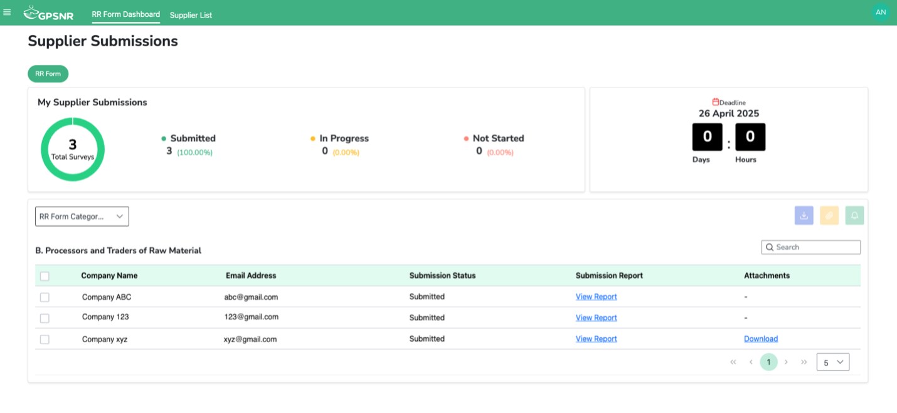

# GPSNR Reporting Requirements FAQ 

**1.	Who should use the new Agridence platform for GPSNR Reporting Requirements (RR) this year?**
All GPSNR members are expected to use the Agridence platform for reporting, starting from 2024 onwards.

**2.	What if a member does not submit the GPSNR RR form?**
If a member does not submit RR for GPSNR reporting for this year, it may lead to suspension of membership.

**3.	Are the RR questions the same as last year?**
Yes, the RR questions are the same. If you wish, you may use the RR questions excel as a template to manually fill in the Agridence form (using the copy and paste function).

**4.	How do I use the platform to submit GPSNR RR?**
For the new platform, Agridence has created a [User Guide](https://rubberplatform.sharepoint.com/:v:/s/GPSNRMembers/EftoJUCUFxdOjmXo0iZj5FkBCVYA8hDc3pTMKoqmzVCi_w?e=t9XPd2&nav=eyJyZWZlcnJhbEluZm8iOnsicmVmZXJyYWxBcHAiOiJTdHJlYW1XZWJBcHAiLCJyZWZlcnJhbFZpZXciOiJTaGFyZURpYWxvZy1MaW5rIiwicmVmZXJyYWxBcHBQbGF0Zm9ybSI6IldlYiIsInJlZmVycmFsTW9kZSI6InZpZXcifX0%3D) and conducted a [Webinar](https://rubberplatform.sharepoint.com/:v:/s/GPSNRMembers/ETYQX1VdqY9NrOPffTEGk1EBgMgvYDvjSwNaD7vY-V1SLQ?e=EW7FDb&nav=eyJyZWZlcnJhbEluZm8iOnsicmVmZXJyYWxBcHAiOiJTdHJlYW1XZWJBcHAiLCJyZWZlcnJhbFZpZXciOiJTaGFyZURpYWxvZy1MaW5rIiwicmVmZXJyYWxBcHBQbGF0Zm9ybSI6IldlYiIsInJlZmVycmFsTW9kZSI6InZpZXcifX0%3D) which has a walkthrough as well.

**5.	What if a member has subsidiaries under the company Group?**
Please refrain from adding the subsidiaries under the “supplier” list as the supplier form is an abridged version. If you would like to add group subsidiaries, please reach out to cs@agridence.com.

**6.	What if my suppliers are not GPSNR members? Do they have to join GPSNR too to submit RR?**
Suppliers do not need to join GPSNR to submit reporting forms to your company. They can also use the same platform to submit their reporting to your company. 

**7.	Can GPSNR members invite their suppliers who are not GPSNR member to use the RR platform?**
Yes, Non-GPSNR suppliers can be invited to the platform to submit the form. The GPSNR member will have to invite them to their supplier list and assign the respective form to them.

**8.	What if I am facing technical issues with the Agridence platform?**
Please email cs@agridence.com

**9.	What if I have questions about the Reporting Requirements which are not related to the technical aspects of the platform**

Please email the following contacts: natalie.low@gpsnr.org and aidan@gpsnr.org

**10.	Will there be a feature to consolidate processors’ (Category B) responses (both non-member and members) for manufacturer’s (Category C) own reporting?**
Yes, manufacturers will have their own dashboard to track their processors' (both member and non-member) submissions. Processors' submissions will be consolidated in the dashboard and they can download a single CSV file containing their processors' responses. The dashboard will be released for GPSNR members with suppliers mid-June. A similar feature will also be made available to end users (Category D) in due course.

**11.	Some questions may not be applicable to non-members of GPSNR for their submission to the downstream category. Will those questions be omitted?**
We have included only the necessary questions for the ‘non-member’ form that the GPSNR working group has identified. 

**12.	I would like to add my own selected questions when assigning the form to my suppliers. How can I add them?**
Please reach out to Agridence to add the additional questions.

**13.	After submitting the form, can I make amendments to the form?**
Users are unable to make amendments to the form after clicking the submit button. However, if necessary, please reach out to cs@agridence.com for help.

**14.	Are all the questions and the uploading of Shapefiles compulsory? Can I proceed without answering questions and uploading the file?**
All questions are not compulsory, so users can proceed with missing fields/without upload files. However, we recommend users to not leave blanks if possible. If there is no answer or not applicable, user can input NA into the field.

**15.	Can multiple users work on/edit the same form?**
Yes. The super admin user can invite teammates to work on the form. However, we advise against working on the form at the same time, as multiple users saving multiple data entries at the same time may result in data overwrite.

**16.	Can the company get more than 1 super user if they have different teams with different suppliers from across the region?**
Yes, they can. They will need to indicate to the GPSNR secretariat who will be compiling the super admin user contact information.

**17.	How do I save my answers?**
Users have to click the “Save” button (found at the bottom of every page) to save the answers, otherwise the answers will be lost when user logs out of the platform. Please ensure that the 'Saved successfully' notification appears before proceeding to logout/continue another action, else data loss might occur. 

**18.	Can user view their previous year’s submission?**
Yes, as this is the first year GPSNR members are using the GPSNR RR platform, members and users will be able to view their previous year’s submission, starting from next year.